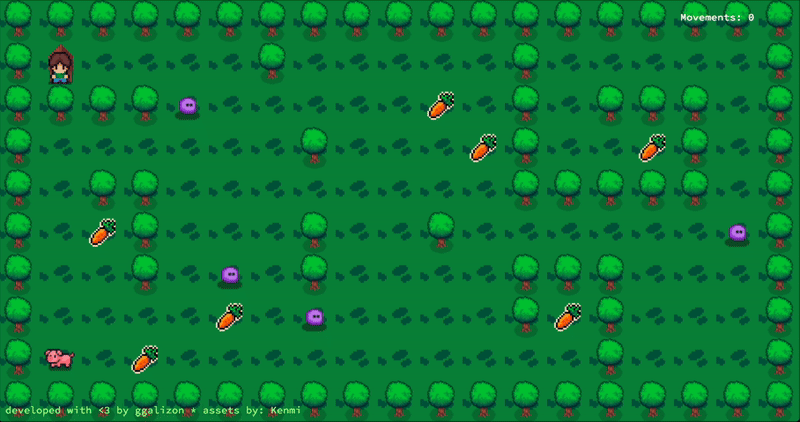

# 🧑‍🌾 so_long



**so_long** is a small 2D game where you control a farmer who must collect all the carrots and bring them to a hungry pig. Built using the MiniLibX graphical library, this project focuses on understanding window management, rendering, and event handling in C.

---

## 🛠️ Build & Run

### 🐌 ~~Boring~~ Mandatory Version

```bash
    make
    ./so_long maps/map3.ber
```
### 🧟‍♂️ Fun Bonus Version

```bash
    make bonus
    ./so_long_bonus maps/bonus_map.ber
```
---

## 🎯 Project Goal

- Create a simple graphical game using MiniLibX.
- Load and display a map from a file.
- Allow the farmer to move across the map.
- Collect all **carrots** to feed the **pig**.
- Exit the game once all carrots are collected and the farmer reaches the pig.

---

## 🧠 Skills Acquired

- 2D array/map parsing
- Event-driven programming with keyboard inputs
- Graphics rendering using MiniLibX
- Game loop logic and collision detection
- File reading and error handling
- Clean and modular C code structure

---

## 📜 Mandatory Rules

- Map must be rectangular and enclosed by walls.
- The map must contain:
  - One player (P – the farmer)
  - At least one exit (E – the pig)
  - At least one collectible (C – carrots)
- The player can only exit after collecting all carrots.
- Movements must be counted and displayed in the terminal.
- No memory leaks allowed.

---

## 🌟 Bonus Features

- Enemies (slime monsters) that move across the map.
- Game ends if the player touches a slime.
- Animations for the farmer movements and slimes.
- Display movement count in the game window.

---

## 🕹️ Controls

- Arrow keys to move the farmer
- `ESC` to exit the game

---

## 🗺️ Map Example

```text
111111
1P0C01
100001
1C0E01
111111
```
- `1`: Wall
- `0`: Empty space
- `P`: Player (Farmer)
- `C`: Carrots
- `E`: Exit (Pig)

- Map must be rectangular and enclosed by walls.
- The map must contain:
  - One player
  - At least one exit
  - At least one collectible
- The player can only exit after collecting all carrots.
- Movements must be counted and displayed in the terminal.

---

Have fun feeding that pig! 🐷🥕

